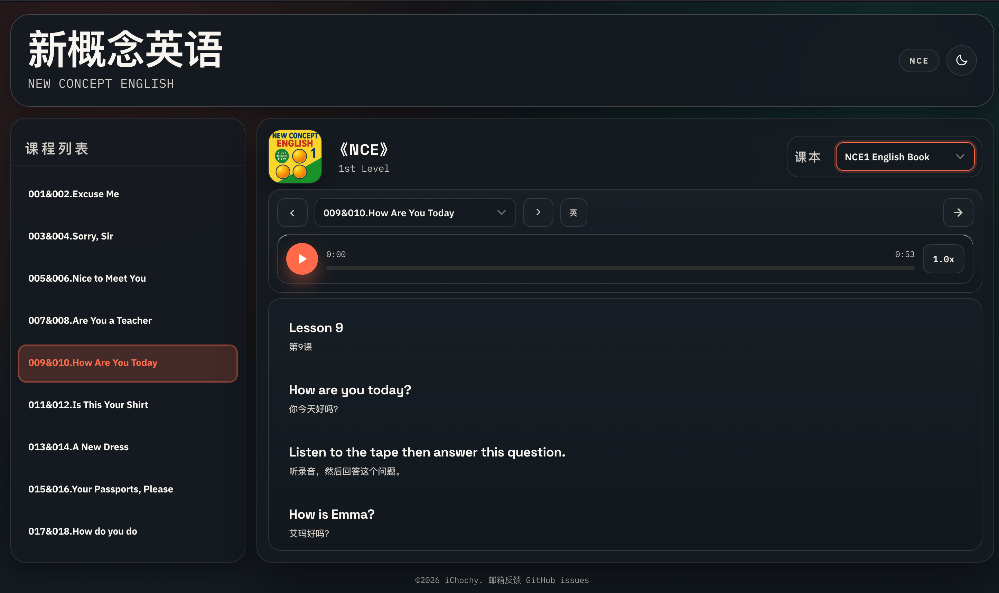
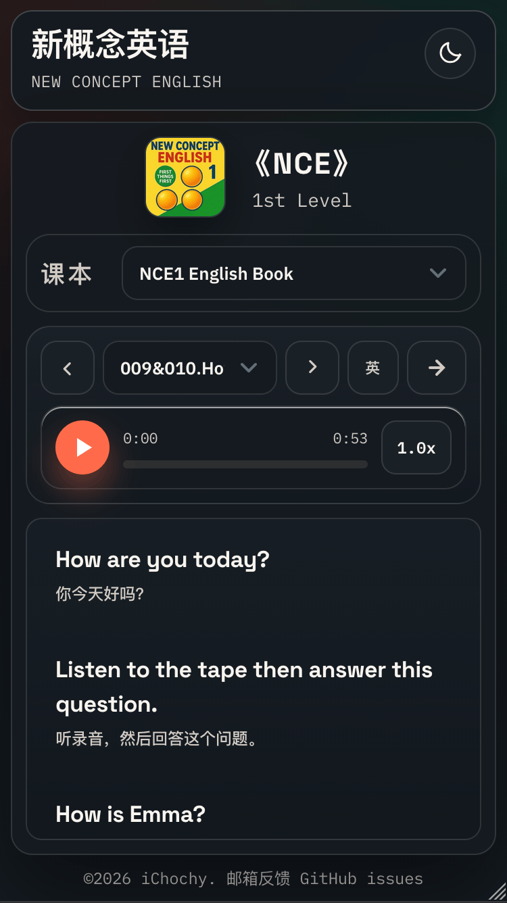

# 新概念英语 · 全四册在线点读系统

**《 New Concept English 》** 全四册在线学习系统，集课文朗读、单句点读、中英对照、单词即点即译、PDF教材同步浏览于一体，随时随地自学英语！

---

### ✨ 主要功能

- 🎧 **美音课文朗读**：流畅自然的原版音频
- 📍 **单句点读**：点击任意句子即可跟读练习
- 📖 **中英对照**：逐句显示中英文，便于理解
- 📝 **单词即点即译**：点击任意单词，弹出词典风格的翻译弹窗
- 📚 **PDF 教材对照**：集成 PDF 教材查看器，听读与教材同步
- 📱 **响应式设计**：手机，平板、电脑均可流畅使用
- 🚀 **无需安装**：浏览器直接访问，随时学习

---

### 📸 截图

### 📚 四册学习指南

#### 📕 第一册：《First Things First》
**目标**：打好语音与基础
**课数**：144课 | **词汇量**：约 600 词
适合 **零基础** 学习者，建立语感和正确发音。

#### 📘 第二册：《Practice and Progress》
**目标**：语法体系与听说读写同步提升
**课数**：96课 | **词汇量**：约 1500 词
适合有基础的学习者，系统梳理语法。

#### 📙 第三册：《Developing Skills》
**目标**：进阶阅读与复杂句型
**课数**：60课 | **词汇量**：约 2500 词
适合想提高综合能力、阅读原版材料的学习者。

#### 📗 第四册：《Fluency in English》
**目标**：接近流利表达与学术阅读
**课数**：48课 | **词汇量**：约 3500–4000 词
适合高阶学习者、考研/雅思/托福备考。

**推荐学习路径**：按册顺序学习 → 第一册打基础 → 第四册冲刺流利。

---

### 🛠️ 技术与资源

- **前端**：HTML + CSS + JavaScript（纯静态实现）
- **音频来源**：美音音频来自 [tangx/New-Concept-English](https://github.com/tangx/New-Concept-English)
- **中文字幕**：由 Gemini AI 生成（已尽力优化，但可能存在少量错误，欢迎大家指正与贡献）
- **翻译 API**：
  - [Free Dictionary API](https://dictionaryapi.dev/) - 提供英文释义、音标
  - [LibreTranslate](https://libretranslate.com/) - 开源自托管翻译引擎
  - 完全免费，基于前端调用，直接运行即可使用完整功能

---

### ⚠️ 说明与版权

- 本项目**仅供个人学习研究使用**，非商业用途。
- 所有内容来源于互联网，我们不拥有版权。
- 如有侵权，请联系 [me@ichochy.com](mailto:me@ichochy.com) 及时处理。
- **强烈建议**支持正版，购买官方教材与音频。

---

### 🤝 如何贡献

欢迎大家一起完善这个项目！

- 提交 Issue 反馈翻译错误、功能建议
- Pull Request 改进代码、修正字幕、添加新功能
- 分享给更多英语学习者

---

### ❤️ 支持原作者

原作者 iChochy 是 80 后码农，目前正在与白血病（CMML）抗争。
工作已暂停，在家无聊就重学英语，就有了这个项目。

如果这个项目对你学习英语有帮助，欢迎：

- **点个 Star** ⭐（[给原作者点个 Star](https://github.com/ichochy/nce)）
- 打赏一杯咖啡 / 一点生命值（可选）

**感谢每一位使用和支持的朋友！**
你的每一次学习，都是对坚持最好的回报。

---

### 📦 关于本修改版

本版本基于 [iChochy/NCE](https://github.com/ichochy/nce) 改编，新增了单词即点即译和 PDF 教材同步浏览功能。

**修改者**：[你的名字]
**GitHub**：[你的 GitHub 地址]
**Email**：[你的邮箱]

---

**Keep learning — progress comes with persistence.**
**坚持学习，每一天都有进步。**
